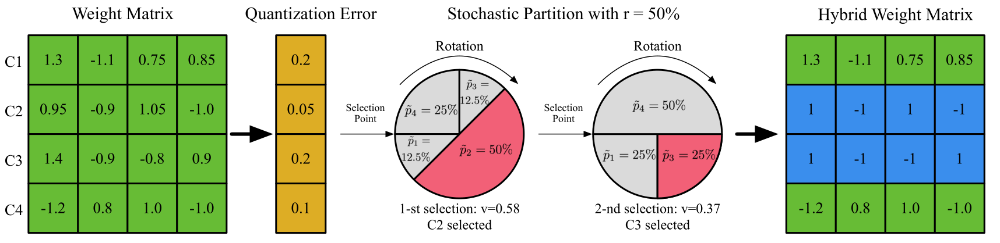
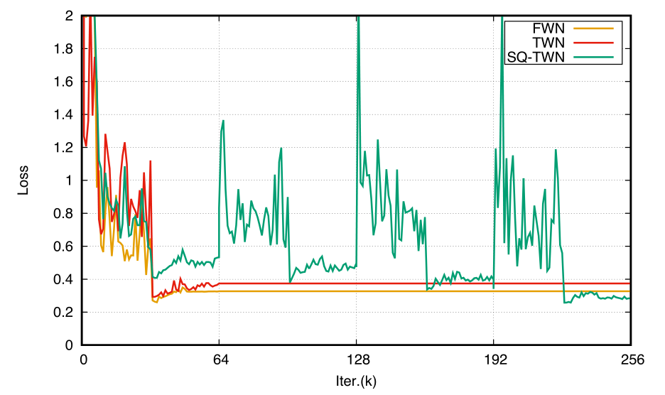

# 使用随机量化算法量化深度神经网络

[原文链接](https://arxiv.org/abs/1708.01001)

作者：

* Yinpeng Dong \(dyp17@mails.tsinghua.edu.cn\) 计算机科学与技术系，清华大学，北京，中国
* Renkun Ni \(rn9zm@virginia.edu\) 美国弗吉尼亚大学
* Jianguo Li \(jianguo.li@intel.com\) 英特尔实验室的中国北京，中国
* Yurong Chen\(yurong.chen@intel.com\) 英特尔实验室的中国北京，中国
* Jun Zhu \(dcszj@mail.tsinghua.edu.cn\) 计算机科学与技术系，清华大学，北京，中国
* Hang Su \(suhangss@mail.tsinghua.edu.cn\) 计算机科学与技术系，清华大学，北京，中国

## 摘要

由于嵌入式应用对存储需求和计算能力较为苛刻，使得使用较少位数表示深度神经网络势在必行。不过，这样会使得精度有所损失。本文的目的是使用随机量化\(SQ\)算法来将DNN网络使用低位数表示。我们使用这种量化方式是基于以下的观察。现有的训练算法在将每一次迭代中都近似地将实数值/滤波器汇总在一起，并使用低位表示。有些数值/滤波器的量化损失比较小，但有些却十分大，这会导致训练时梯度指向不合适的方向，这会导致精度显著下降。另外，SQ量化将一部分数值/滤波器量化为低位表示，这里量化误差与随机概率成反比\(其他未量化的值保持全精度\)。每次迭代中，量化和全精度的部分会根据相关的梯度进行更新。SQ率会随着整个网络的量化而增加。这个过程中会对量化的误差进行补偿，并且使低位表示的DNN获取较好的精度。我们用实验展示了SQ算法，可以在各种数据集和网络结构下保证\(并提高\)不同位数表示的DNN网络的精度。

## 1. 算法介绍

深度神经网络\(DNN\)在大多数机器视觉任务上可以具有显著的性能提升，例如图像分类，物体检测和语法分割。DNN通常具有几十层或上百层，那其中的参数的数量几乎是天文数字。因此，使用DNN的系统通常要考虑自身的存储和计算能力。这就阻碍了DNN应用在资源比较缺乏的系统上的部署，尤其是物联网领域的嵌入式设备。

很多方法为了减少模型参数的尺寸或计算的复杂度，导致DNN网络过度冗余。其中，低位宽深度神经网络旨在使用少量的位数来表示模型权重，甚至是激活输出，由于其对模型尺寸和计算量都很有效，所以吸引了很多注意。在二值链接\(BNN\)中，权重只有两个值，+1和-1，并且使用加法和减法来代替乘法，从而加速计算。在《Xnor-net:Imagenet classification using binary convolutional neural networks》这篇论文中，作者将二值权重网络\(BWN\)的每个滤波器加上特定的缩放因子，并且讲这种方法扩展到XNOR-Net\(将权重和激活数据都进行二值化\)。另外，三值权重网络\(TWN\)增加了0，元素由+1,0和-1表示，使用两个bit。不过，低位深度神经网络也被不可忽略的精度下降所困扰，特别是特别大的模型\(比如：ResNet\)。我们认为由于模型的尺寸的原因，导致这些放在每一次训练迭代是对DNN的权重进行低位量化。并不是所有元素和滤波器的量化误差都特别小。大误差的元素和滤波器将会在训练时将梯度的方向带跑偏，并且会让模型收敛与相对较差的局部最小。

除了在训练时的低位量化方案，这里同样也有后量化的方案，也就是对预训练的全精度模型直接进行量化。这种方法有两个局限。首先，其对做分类的DNN网络较好，不过对于其他类型\(比如：检测和语法分割\)的网络就缺乏灵活性。其次，低位量化可作为对局部最小值的量化解决方案或正则约束。不过，将局部最小从全精度量化为低位宽，并做到权重无损，对于后量化方案\(即使有微调\)也是相对困难的。

本文中，我们尝试对DNN使用随机量化\(SQ\)算法对上述问题进行攻克。受随机深度和dropout的影响，SQ算法会在每次迭代时，随机选择DNN中的部分权重，并使用低位对其进行量化，不过会保存这部分全精度的数值。选择概率与量化误差成反比。我们会逐渐的增加SQ率，直到网络完全量化。

我们在不同方面对SQ算法进行了一个综合的调研。首先，我们对选择粒度的影响进行调研，将滤波器的每个通道看作为随机选择的量化结果，要好于将每个权重值进行量化的结果。这是因为滤波器中的每个通道中的权重会互相作用，从而正确表示滤波器的结构，因此当把权重独立看待时\(滤波器通道中一些权重是量化过的，有些是全精度表示\)，可能会带来结果的变形。其次，我们比较了轮盘\(_roulette_\)算法和一些具有选择性的算法进行了比较。轮盘算法选择量化的值/滤波器其概率与量化误差成反比。如果量化误差特别明显，我们就不能对相应的值/滤波器进行量化，因为量化的话可能带来不准确的梯度信息。轮盘算法比其他选择算法好的方面在于，它消除了寻找最佳初始分区的要求，并且由于随机算法的探索性，使得其有能力为解决方案提供更好的搜索空间。其三，我们对比了不同方法间计算量化与所形成量化误差比例。其四，我们设计了一种可行的方案用于计算SQ率。

SQ算法普遍适用与任意低位DNN网络，包括BWN和TWN，等等。实验表明SQ方法可以提升低位DNN网络的精度\(二值或三值\)，可使用任意网络结构\(VGGNet, ResNet等\)，以及任意数据集\(CIFAR，ImageNet等\)。例如，TWN使用SQ算法进行训练，在很多测试集上能与全精度模型相抗衡。

我们做了如下几件事：

1. 我们的使用随机量化\(SQ\)算法克服目前低位DNN训练算法所存在的精度损失问题。
2. 我们在不同场景对SQ进行综合调研，比如选择粒度，划分算法，量化概率的方法和更新SQ率的方案，这些对于在深度学习领域对其他随机算法进行研究的人员来说，可能会有较大的帮助。
3. 各种低位设置，网络架构和测试数据下，我们的方案都对性能有很大的提升。

## 2. 低位深度神经网络

本节我们先来简单的介绍几个典型的低位DNN网络，包括BNN，BWN和TWN。我们将DNN的第$$l$$ 层表示为$$\mathcal W_l = \{ W_1,...,W_i,...,W_m \}$$ ，这里的$$m$$表示为输出通道的数量。$$W_i \in\mathbb{R}^d$$ 用来表示滤波器第$$i$$个通道的权重向量，这里卷积层中的$$d =n \times w \times h$$，全连接层中的$$d=n$$\(这里的$$n, w,h$$表示_输入通道数_，_卷积核宽度_和_卷积核高度_\)。$$\mathcal W_l$$也可以看作为有$$m$$行的权重矩阵，并且每行$$W_i$$都是一个$$d$$维向量。方便起见，我们后面暂时忽略$$l$$。

**二值权重网络**使用简单的随机方式将32位权重向量$$W_i$$使用如下方程量化为二值$$B_i$$：

$$
 (1)\   B_i^j=\left\{
 \begin{aligned}
+1   && \ , p=  \sigma(W^j_i)  \\
-1    && \ ,1 - p \\
 \end{aligned}
 \right.
$$

这里的$$\sigma(x) = max(0,min(1,\frac{x+1}{2})) $$函数是个棱角分明的S曲线，并且$$j$$为$$W_i$$向量的索引。

训练阶段，算法会将全精度权重和二值化的权重都进行保存。二值化权重用于梯度和前向loss的计算，不过使用全精度权重用于对权重进行更新。

测试阶段，使用二值化的权重，能让模型减少32倍。

**BWN**是一个扩展二值权重网络，不过要引入实值比例因子$$\alpha \in \mathbb{R}^+$$与$$B_i$$计算可以近似得到全精度向量$$W_i$$ ,$$\alpha$$可以通过求解一个优化方程$$\mathcal{J}=min||W_i-\alpha B_i||$$获得：

$$
(2) \ B_i =sign(W_i),\alpha=\frac{1}{d} \sum_{j=1}^{d} |W_i^j|
$$

**TWN**在BWN基础上添加了0，可以通过量化因子$$\alpha$$与三元向量$$T_i \in \{1,0,-1\}^d$$进行计算，可以得到更加靠近原始$$W_i$$权重的向量。同时，又能保证对模型尺寸的高度压缩\($$16 \times$$\)。$$\alpha$$可以通过求解一个优化方程$$\mathcal{J}=min||W_i-\alpha T_i||$$获得：

$$
(3) \ T_i^j=\left\{
\begin{aligned}
+1   && ,if \quad W_i^j >\Delta  \\
0 && ,if \quad |W_i^j| \le \Delta \\
-1    && ,if \quad W_i^j <-\Delta \\
\end{aligned}
\right.
\quad ,
\alpha = \frac{1}{|I_{\Delta}|} \sum_{i \in I_{\Delta}}|W^j_i|
$$

这里的$$\Delta$$是通过下面一些值计算出的一个正阈值：

$$
(4)\ \Delta=\frac{0.7}{d}\sum_{j=1}^d|W_i^j|
$$

$$I_\Delta=\{j||W_i^j|>\Delta\}$$，$$|I_\Delta|$$为$$I_\Delta$$的子集。

## 3. 具体方法

本节，我们会对SQ算法进行详细的说明。对于已知的低位深度神经网络我们会逐层进行量化。简单起见，我们只对网络中的一层进行处理。我们是要前向和后向过程中对每层中一部分权重进行低位量化，这是为了让量化信息的损失最小化。

> 图1：展示了随机量化的整个过程。要给定一个卷积层的权重矩阵和一个SQ率$$r$$，首先要计算出量化误差。然后，我们就可以得到滤波器中每个通道\(图中表示为矩阵的行\)的概率，并且采用基于概率的无替换轮盘算法来对矩阵中的一部分行进行选择性量化。最后，我们获得了量化和未量化行的混合矩阵。在训练过程中，前向和后向传播的执行都基于这个混合矩阵。

图1描述了随机量化算法。我们首先计算量化误差，然后推算出每个值/滤波器的量化概率$$p$$\(3.2节详述\)。给定一个SQ值$$r$$，然后随机的选择一部分值/滤波器，使用轮盘算法进行量化\(3.1节详述\)。最后，我们会在3.3节中对训练过程进行论证。

### 3.1 随机分配

每次迭代中，每层的权重矩阵为$$\mathcal{W}=\{W_1,...,W_m\}$$，我们将$$\mathcal{W}$$中的行划分成两个不相交的组$$G_p=\{W_{q1},...,W_{q_{N_q}}\}$$和$$G_r=\{W_{r_1},...,W_{r_{N_r}}\}$$，这两个组满足下述条件：

$$
(5) \ G_q \cup G_r , G_q \cap G_r = \varnothing,
$$

这里$$W_i \in \mathbb{R}_d$$表示滤波器中的第$$i$$个输出通道，或权重矩阵$$\mathcal{W}$$的第$$i$$行。这里我们将$$G_p$$中的权重行量化位低位值，同时$$G_r$$中的权重保持不变。$$G_p$$包括$$N_q$$个数，其个数受限于SQ值$$r(N_q=r\times m)$$。同时，$$N_r =(1-r) \times m $$。SQ值$$r$$会随着整个量化矩阵$$\mathcal{W}$$的过程逐渐增加，直到对量化网络的训练完成。我们为权重矩阵$$\mathcal{W}$$的每行量化概率$$p \in \mathbb{R}^m$$，这里第$$i$$个元素的概率为$$p_i$$，这个概率即为第$$i$$行的量化概率。量化概率的定义高于量化误差，将会在3.2节详述。

给定网络中每层的SQ值$$r$$和量化概率$$p$$，我们建议使用过使用轮盘算法选择$$G_p$$中的$$N_q$$行进行量化，同时剩下的$$N_r$$行依旧使用全精度表示。算法1展示了轮盘选择算法流程。

---

**算法1** 轮盘算法将权重矩阵分成量化值与真实值两部分

* **输入**: 所有通道的权重矩阵$$\mathcal{W}$$ 的SQ率$$r$$和量化概率向量$$p \in \mathbb{R}_m$$ 。
* **输出**: $$G_q$$和$$G_r$$权重组

$$G_q = \varnothing;G_r = \varnothing$$

$$N_q =r \times m;$$

$$for \  i = 1 \ to \ N_q \ do$$

$$Normalize   {p}  \ (with \ {p} = p / ||p||_1);  \ \ \  \triangleright ||p||_1 \ is \ L1 \ norm \ of \ p$$

$$Sample \  a \ random \ value \ v_i \ uniformly \ in \ (0,1];$$

$$Set \ s_i = 0, \ and \ j \ = 0;  \ \ \ \triangleright s_i  \ accumulates \ the \ normalized \ probability$$

$${while} \  s_i < v_i \  {do};$$

$$j=j+1;s_i=s_i+ \hat{{p}_j}; \ \ \  \triangleright  \hat{{p}_j} \ is \ the \ j-th \ element \ p$$

$${end \ while}$$

$$G_q = G_q \cup \{W_j\};$$

$$p_j =0;   \ \ \ \triangleright   avoid \ j \ th \ channels \ being \ selected \ again$$

$$ {end \ for}$$

$$G_r= \mathcal{W} /\ G_q;$$

---

### 3.2 从量化误差到量化概率

话说回来，我们的这种方法可以缓解由于过大的量化误差所导致的梯度方向偏差，每个通道的量化概率应该基于量化权重与实际权重之间的量化误差。如果量化误差很小，相关通道的量化的信息损失将会非常小，那么我们就应该给这个通道一个比较大的量化概率。这就意味着量化概率与量化误差之间成反比关系。

我们用$$W_i$$表示全精度的权重向量，用$$Q_i$$表示这个权重向量的量化版本。简单起见，这里省略$$Q_i$$的位宽或缩放系数$$\alpha$$。也就意味着使用$$B_i, T_i$$或$$\alpha B_i, \alpha T_i$$用来表示不同低位DNN网络。我们根据$$W_i$$和$$Q_i$$的正则$$L_1$$距离来衡量量化误差：

$$
(6) \ e_i = \frac{||W_i - Q_i||_1}{||W_i||_1}
$$

之后，我们使用计算出来的量化误差向量$$ {e}=[e_1, e_2, ...,e_n]$$来定义量化概率。量化概率$$p_i$$与$$e_i$$成反比。我们定义了一个中间变量$$f_i= \frac{1}{e_i + \varepsilon}$$ 来表示这个反比关系，这里$$\varepsilon$$是一个非常小的值，例如$$10^{-7}$$，加上这个数仅是为了避免除零操作。概率方程$$f_i$$必须是一个单调递增函数。这里我们可以考虑四种不同的选择：

1. 常量函数：对于所有通道使用同一个概率：$$p_i= \frac{1}{m}$$。这样在对全局使用随机选择策略时，就能忽略量化误差。
2. 线性函数：比如$$p_i = \frac{f_i}{\sum_jf_j}$$。
3. softmax函数：比如$$p_i = \frac{e^{f_i}}{\sum_je^{f_j}}$$。
4. S形函数：比如$$p_i= \frac{1}{1+e^{-f_i}}$$。

我们会在4.2节来展示这四种选择的性能。

### 3.3 使用随机量化进行训练

当我们要应用随机量化算法去训练一个低位DNN网络，其需要四步：

1. 随机分割权重
2. 前向预测
3. 后向传播
4. 参数更新

算法2展示了使用随机量化方式训练低位DNN网络的过程。

---

**算法2** 基于SQ的训练算法

* **输入**: 迷你批次数据，目标{X, Y}和损失函数$$\mathcal{L}(Y, \hat{Y})$$；权重$$\mathcal{W}^t$$，第t次迭代时的学习率$$\eta^t$$和SQ率$$r^t$$。
* **输出**: 更新过的$$\mathcal{W}^{t+1}$$，学习率$$\eta^{t+1}$$和SQ率$$r^{t+1}$$

量化$$\mathcal{W}^t$$的每行，并得到量化矩阵 $$\mathcal{Q}^t$$；

if $$r^t$$ &lt; 100% then​

计算量化误差e；

计算量化概率p；

使用算法1中的$$r^t$$和**p**向量，将$$\mathcal{W}^t$$划分为$$G_q$$和$$G_r$$ ；

计算得混合矩阵$$ { \mathcal{Q}^t}$$：当$$W_i \in G_r$$ 那么$$  {Q_i} = W_i$$，否则$$  {Q_i} = Q_i$$ ；

$$else$$

​ $$ {Q^t}=Q^t$$;

$$end \ if$$

$$\hat{Y} = Forward(X,  {\mathcal{Q}^t})$$;

$$\frac{\partial \mathcal{L}}{\partial  { \mathcal{Q}_t}}=Backward(\frac{\partial \mathcal{L}}{\partial \hat{Y}},   { \mathcal{Q}^t })$$

根据等式7更新$$\mathcal{W}^{t+1}$$

$$\eta^{t+1}, r^{t+1} = Update(\eta^t, r^t, t)$$

---

首先，对$$\mathcal{W}$$的所有行进行量化后，得到$$\mathcal{Q}$$。注意我们这里并没有指定量化算法和位宽，所以我们的算法可以靓货的应用于所有的情况。我们之后会通过等式\(6\)计算量化误差，以及相关量化概率。通过给定的参数，我们使用算法1将$$\mathcal{W}$$划分为$$G_q$$和$$G_r$$。然后我们就获得了由量化权重和未量化权重组成的权重矩阵$$ {Q}$$。当$$W_i \in G_q$$时，我们使用$$ {Q}$$中量化的版本$$Q_i$$。否则，我们就直接使用$$W_i$$。$$ {Q}$$与$$\mathcal{Q}$$相比，更接近实际值的量化矩阵$$\mathcal{W}$$，这样就能提供更加合适的梯度方向。我们使用混合梯度$$\frac{\partial \mathcal{L}}{\partial  { \mathcal{Q}_t}}$$ 在每次迭代时对$$\mathcal{W}$$进行更新：

$$
(7) \ \mathcal{W}^{t+1} = \mathcal{W}^t - \eta^t \frac{\partial \mathcal{L}}{\partial  { \mathcal{Q} ^t}}
$$

这里$$\eta^t$$是第t次迭代的学习率。这就意味着量化部分可以通过量化后的权重的梯度进行更新，并且未量化部分将使用全精度的梯度进行更新。最后，学习率和SQ率按照预定义的一种规则进行更新。我们将在4.1节介绍这个规则。

当训练停止，$$r$$将会增加到100%，并且网络中的所有权值都被量化。这也意味着，最后就没有必要保留全精度的$$\mathcal{W}$$矩阵了。我们执行前向预测过程时，只需要使用低位量化权重$$\mathcal{Q}$$矩阵进行。

## 4 实际操作

我们使用CIFAR-10，CIFAR-100和ImageNet这种大型的分类网络的数据，来验证我们的算法是否有效。我们在两种低位网络\(BWN和TWN\)上使用SQ算法，并且展示了其在现存低位DNN的量化优势。

### 4.1 数据集和实现细节

我们简单的介绍一下在我们使用该算法时所使用到的数据集，包括相关网络结构和训练设置。

* **CIFAR** 其训练集包括5万张图片，测试集包括1万张图片，每张图片都是彩色图片，分辨率为$$32 \times 32 $$ ，在CIFAR-10中图片分为10类，在CIFAR-100中图片分为100类。我们两种分类都进行了测试。首先使用的是VGGNet网络，表示为VGG-9，其结构为“\(2 x 64  C3\) - MP2 - \(2 x 128  C3\) -MP2-\(2 x 256  C3\) - MP2 - \(2 x 512  FC\) - 10/100  FC - Softmax”。网络使用SGD方式作为训练方案，衰退率为0.9，权重衰退为0.0001，并且批量尺寸为100。我们在网络中未使用增强的方式。我们其实的学习率为0.1，每1.5万次迭代就除以10，训练一共迭代10万次。第二个网络是ResNet-56期架构就不详述了。
* **ImageNet** 是一个大型的数据分类数据集。我们使用ILSVRC 2012数据集，其具有128万张训练图片，其中有1000个类别。我们使用5万张交叉验证图片对网络性能进行评估。我们使用了AlexNet的一个变种，其架构带有批量归一化\(AlexNet-BN\)和ResNet-18。我们使用SGD\(衰退率为0.9，权重衰退为$$5 \times 10^{-5}$$\)，并且批次尺寸为256。初始化学习率为0.01，在第10万、15万和18万次迭代时学习率除以10，训练一共迭代20万次。在AlexNet中使用批归一化，是为了得到更快的收敛速度和更好的稳定性。ResNet-18使用SGD方法进行训练，批次尺寸为100，衰退参数与AlexNet-BN相同。学习率初始化为0.05，在错误平稳期除以10，训练一共迭代30万次。

我们基于Caffe框架来实现我们的算法，并且在训练和测试时使用nVidia Titan X GPU进行测试。我们对比了全精度权重网络\(FWN\)，二值权重网络\(BWN\)和三值权重网络\(TWN\)。我们将使用SQ算法训练过的二值和三值网络表示为SQ-BWN和SQ-TWN。对于CIFAR-10和CIFAR-100来说，我们对比了基于VGG-9和ResNet-56网络的FWN，BWN，TWN，SQ-BWN和SQ-TWN。对于ImageNet，我们将上5个网络与AlexNet-BN和ResNet-18网络架构进行了比较。

SQ率$$r$$在我们的算法中是一个很关键的超参，其会逐步的增加到100%\(表示有多少网络权重被量化\)。在这个网络中，我们将训练分成好几个阶段，每个阶段所使用的$$r$$相同。当训练到达某个阶段，我们会增加$$r$$的值，并且进入下一个阶段，直到最终阶段$$r=100\%$$。我们将会在4.2节中使用剃刀研究的方式对SQ率进行更新。我们使用了另一种简化的方法，就是对于同一训练阶段的所有层，其$$r$$值相同。当SQ算法应用于低位网络的训练时，其训练迭代次数为原始迭代次数的s倍，这里的s表示SQ阶段数，在每个阶段的迭代次数都相同\(虽然我们并不需要这么多次数来达到收敛\)。

### 4.2 剃刀研究

有很多因素会影响到我们算法的结果，包括选择粒度、分割算法、量化概率方程和SQ率更新的方式。因此，我们对这些因素设计了一些实验，并且分析了其对我们算法的影响。所有剃刀研究都是基于ResNet-56网络和CIFAR-10数据集。考虑到这些因素的互相作用，我们采用变量控制的方法来减轻我们的负担。选择粒度、分割算法、量化概率方程和SQ率更新的方式默认都是对通道级别的，随机分割\(轮盘\)、线性函数和训练的四个阶段的SQ率r分别为50%, 75%, 87.5%和100%。

**通道级别量化** vs. **元素级别量化**

我们首先研究量化粒度对性能的影响。我们采用了两种策略，通道级和元素级，结果在表1中展示。元素级选择忽略了滤波器结构和通道内元素的相互作用，这都是会导致低精度的原因。通过将每个滤波器的通道看做一个整体，我们可以保持通道的结构，并获得较高的精度。

|  | 通道级 | 元素级 |
| :---: | :---: | :---: |
| SQ-BWN | **7.15** | 7.67 |
| SQ-TWN | **6.20** | 6.53 |

> 表1：选择粒度的测试误差\(%\) \[使用ResNet-56网络和CIFAR-10数据集\]

**随机选择** vs. **确定分割** vs. **固定分割**

我们的算法使用基于轮盘算法的随机分割方式，来选择$$N_q$$行被量化。我们认为，随机划分可以消除初始化后寻找最佳分区的要求，并且具有开拓性的探索空间，可寻求更好的解决方案。为了证明，我们比较了纯随机方法和其他两种非完全随机的方式。第一个为确定性方式，其使用了基于排序的分割。给定SQ率r和量化误差向量e，我们将权重矩阵按照向量e进行排序，然后每次迭代时，选取误差最小的$$N_q$$行作为$$G_q$$。另一种是固定选择方式，这里我们只在第一次迭代时进行轮盘分割，并且保持$$G_q$$和$$G_r$$在整个训练过程中固定。

表2展示了对比结果。其显示随机方式对于BWN和TWN要明显好于其他两种方式，这也就证明了随机分割对于这个算法的成功来说十分重要。另一个插值方式是将随机量化正规化，这也有利于性能。

|  | 随机分割 | 确定分割 | 固定分割 |
| :---: | :---: | :---: | :---: |
| SQ-BWN | **7.15** | 8.21 | \* |
| SQ-TWN | **6.20** | 6.85 | 6.50 |

> 表2：不同分割方式的测试误差\(%\) \[使用ResNet-56网络和CIFAR-10数据集\]。其中\*表示没有覆盖到。

**量化概率方程**

在3.2节中，我们介绍了四种量化概率方程，可用于计算量化误差。分别为常数、线性、softmax和S形方程。我们比较的结果如表4所示。在这些选择中，线性方式因具有更好的性能击败了其他几种方式，并且这是一种非常简单的方式。我们发现不同方程的性能都很接近，这表明这项可能对随机分割速算法影响不大。

|  | 线性 | 常量 | Softmax | S型 |
| :---: | :---: | :---: | :---: | :---: |
| SQ-BWN | **7.15** | 7.44 | 7.51 | 7.37 |
| SQ-TWN | **6.20** | 6.30 | 6.29 | 6.28 |

> 表4：给定的四种量化概率方程所得到的测试误差\(%\) \[使用ResNet-56网络和CIFAR-10数据集\]

**更新SQ率的策略**

我们也对更新SQ率的方式进行了研究。我们假设训练使用随机量化，并且会分割成很多阶段，并且每个阶段都有固定的SQ率。在这样的设置下，我们使用四个SQ率50%，75%，87.5%和100%。我们称这为指数方式\(Exp\)，为量化部分是之前阶段的一半。我们将我们的结果与其他两种方式进行了比较：平均方式\(Ave\)和微调方式\(Tune\)。平均方式包括了5个阶段，SQ率为20%，40%，60%，80%和100%。微调方式尝试使用微调预训练的全精度模型，其中阶段与指数方式相同，而非重头开始。

表3展示了我们比较的结果。指数方式很明显的要好于其他两种方式。使用我们的方法最好是重头进行训练。

|  | Exp | Ave | Tune |
| :---: | :---: | :---: | :---: |
| SQ-BWN | **7.15** | 7.35 | 7.18 |
| SQ-TWN | **6.20** | 6.88 | 6.62 |

> 表3：使用不同方式更新SQ率所得到的测试误差\(%\) \[使用ResNet-56网络和CIFAR-10数据集\]

### 4.3 性能测试

我们在BWN和TWN上，使用CIFAR-10，CIFAR-100和ImageNet数据集对SQ算法和传统算法进行比较。为了公平起见，我们为其设置了相同的学习率、优化方法、批次尺寸等参数。我们对使用SQ方式的实验使用最佳配置\(通道级量化选择，随机划分，线性量化概率方程和指数SQ率更新方式\)。

表5展示了使用CIFAR-10和CIFAR-100的结果。在这两个例子中，SQ-BWN和SQ-TWN性能极大的超越了BWN和TWN，特别在ResNet-56上，这个网络比较深，而且其梯度容易被量化后的权重所造成的误差所影响。例如，使用ResNet-56网络结构，配合CIFAR-10数据集，SQ-BWN的精度要比BWN高9.27%。具有2位的SQ-TWN模型甚至可以获得比全精度模型更高的准确率。我们的结果展示了，SQ-TWN相对于全精度的模型，分别将精度提升了0.63%\(VGG-9网络，CIFAR-10数据集\), 0.49%\(ResNet-56网络，CIFAR-10数据集\)和0.59%\(ResNet-56网络，CIFAR-100数据集\)。

|  |  | CIFRA-10 | CIFRA-10 | CIFRA-100 | CIFRA-100 |
| :---: | :---: | :---: | :---: | :---: | :---: |
|  | Bits | VGG-9 | ResNet-56 | VGG-9 | ResNet-56 |
| FWN | 32 | 9.00 | 6.69 | 30.68 | 29.49 |
| BWN | 1 | 10.67 | 16.42 | 37.68 | 35.01 |
| SQ-BWN | 1 | 9.40 | 7.15 | 35.25 | 31.56 |
| TWN | 2 | 9.87 | 7.64 | 34.80 | 32.09 |
| SQ-TWN | 2 | **8.37** | **6.20** | 34.24 | **28.90** |

> 表5：5中不同组合间的测试误差\(%\)比较。我们的SQ算法依旧具有很好的效果。SQ-TWN的精度甚至超过了全精度模型。

图2和图3展示了ResNet-56网络在CIFAR-10上的测试损失曲线。

> 图2：FWN，BWN和SQ-BWN使用ResNet-56网络和CIFAR-10数据集的测试损失。

> 图3：FWN，TWN和SQ-TWN使用ResNet-56网络和CIFAR-10数据集的测试损失。

图2中BWN的损失比SQ-BWN高很多，SQ-BWN和FWN相对就要低很多。图3中，我们可以看到每个阶段的开始，量化更多的权重意味着就有更大的损失。最后，SQ-TWN会得到比FWN更低的损失，同时TWN的损失要比FWN高很多。

表6展示了在标准ImageNet的5万交叉验证集上的结果。

|  |  | AlexNet-BN | AlexNet-BN | ResNet-18 | ResNet-18 |
| :---: | :---: | :---: | :---: | :---: | :---: |
|  | Bits | top-1 | top-5 | top-1 | top-5 |
| FWN | 32 | 44.18 | 20.83 | 34.80 | 13.60 |
| BWN | 1 | 51.22 | 27.18 | 45.20 | 21.08 |
| SQ-BWN | 1 | 48.78 | 24.86 | 41.64 | 18.35 |
| TWN | 2 | 47.54 | 23.81 | 39.83 | 17.02 |
| SQ-TWN | 2 | 44.70 | 21.40 | 36.18 | 14.26 |

> 表6：AlexNet-BN和ResNet-18 在5中不同的组合下，使用ImageNet数据集的测试误差\(%\)。

我们比较了SQ-BWN, SQ-TWN，FWN， BWN和带AlexNet-BN的TWN和ResNet-18架构，所有的错误都只对图片进行了中心缩放。这展示了我们的算法对于提升性能有很大的帮助，甚至有些能超过全精度基线。我们可以看到SQ-TWN的结果更加接近FWN。这里需要注意有些方法会保证网络的第一层和最后一层为全精度，这是为了缓解精度损失。虽然我们没那样做，但是SQ-TWN也能达到近似全精度模型的精度水平。所以，我们的结论是，SQ算法能有效地提高网络性能。

## 5 总结

本文旨在使用SQ算法获得低位的高精度DNN网络。在每次迭代中，我们基于轮盘算法对权重进行随机选取后量化，同时我们保证其余的权重为全精度表示。混合权重能提供更好的梯度指向，并达到较好的局部最小值。我们证明了我们的算法在比较低的位数时，对于算法有较为有效的提升。我们的代码在github上开源，可以访问  [https://github.com/dongyp13/Stochastic-Quantization](https://github.com/dongyp13/Stochastic-Quantization) 获得源码。未来我们会考虑将随机量化算法应用到权重以及激活输出端。

## 鸣谢

Yinpeng Dong和Renkun Ni在Intel实验室实习时完成，他们的导师是Jianguo Li。Yinpeng Dong, Jun Zhu和Hang Su也得到了中国国家重点基础研究发展计划项目\(2013CB329403\)和中国国家自然科学基金\(61620106010, 61621136008\)的支持。

